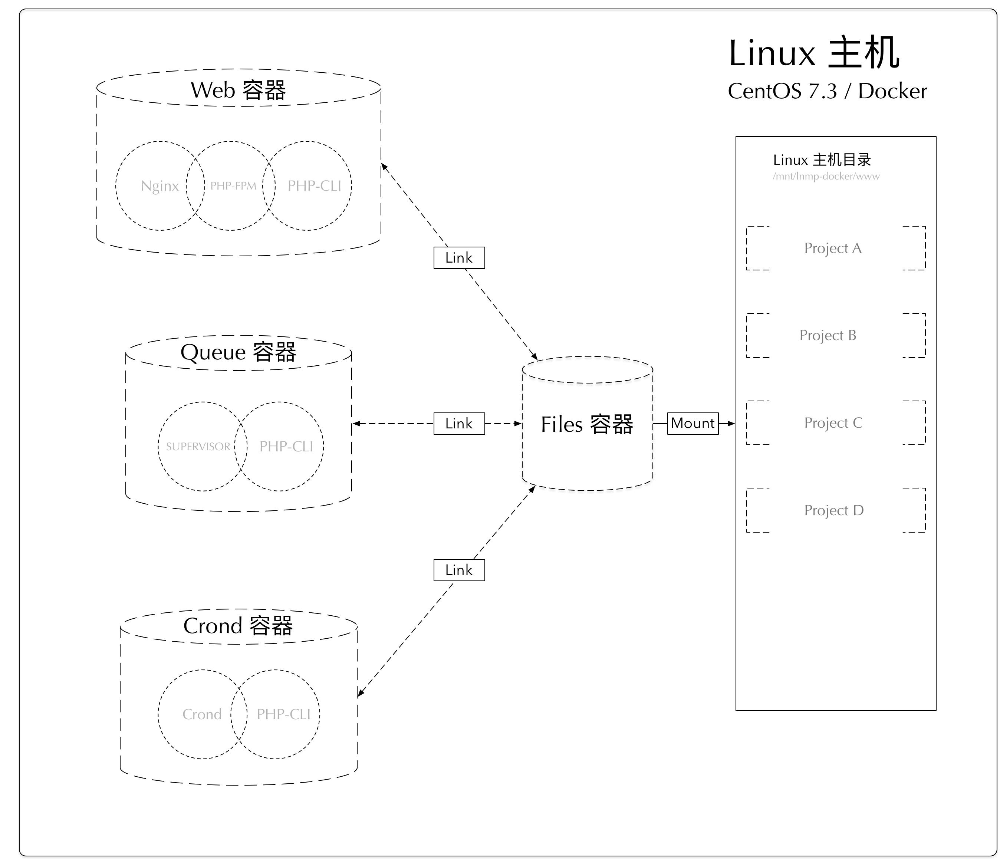

快速构建开发、测试、生产（Docker + Nginx + MySQL + PHP7/5 + Redis + Crond + Queue）的容器环境（**LNMP一键安装程序**）。



## 使用说明
### **依照本扩展安装docker环境，主机只需要安装以下扩展**
- docker
- docker-compose
- composer - 参考下面的文档 [6.使用composer](#6使用composer)

### 项目构建容器包括：
- php-fpm (支持新增php5.6版本容器)
- nginx
- mysql
- redis
- crond （支持新增php5.6版本容器）
- queue （支持新增php5.6版本容器）
- phpmyadmin
- phpredisadmin

### 依赖自定义基础镜像
- php-fpm 基础镜像：[luzucheng/php7.2.15-fpm-alpine-ext:latest](https://github.com/luzucheng59/docker-library/tree/master/php/7.2/fpm-alpine)
- php-cli 基础镜像：[luzucheng/php7.2.15-cli-alpine-ext:latest](https://github.com/luzucheng59/docker-library/tree/master/php/7.2/cli-alpine)

### 项目特点：
1. `100%`开源
2. `100%`遵循Docker标准
3. 支持**多版本PHP**共存，可任意切换（PHP5.6、PHP7.2， 默认只安装php7.2, 如果需要5.6版本，去除docker-compose.yml注释后重新 build)
4. 支持绑定**任意多个域名**
5. 支持**HTTPS和HTTP/2**
6. **PHP源代码、MySQL数据、配置文件、日志文件**都在Host中直接修改查看
7. 内置**完整PHP扩展安装**命令
8. 默认安装`redis`、`swoole`、`imagick`、`memcached`、`ldap`、`events`等常用热门扩展，拿来即用
9. 带有 phpmyadmin 和 phpredisadmin 数据库在线管理程序
10. Queue容器 新增`workerman`支持，可执行基于`sockets`的脚本
11. 实际项目中应用，确保`100%`可用
12. 一次配置，**Windows、Linux、MacOs**皆可用

# 目录
- [1.目录结构](#1目录结构)
- [2.快速使用](#2快速使用)
- [3.切换PHP版本](#3切换php版本)
- [4.添加快捷命令](#4添加快捷命令)
- [5.使用Log](#5使用log)
    - [5.1 Nginx日志](#51-nginx日志)
    - [5.2 PHP-FPM日志](#52-php-fpm日志)
    - [5.3 MySQL日志](#53-mysql日志)
- [6.使用composer](#6使用composer)
- [7.数据库管理](#7数据库管理)
    - [7.1 phpMyAdmin](#71-phpmyadmin)
    - [7.2 phpRedisAdmin](#72-phpredisadmin)
- [8.在正式环境中安全使用](#8在正式环境中安全使用)
- [9.常见问题](#9常见问题)
    - [9.1 如何在PHP代码中使用curl？](#91-如何在php代码中使用curl)


## 1.目录结构

```
/
├── conf                        配置文件目录
│   ├── conf.d                  Nginx用户站点配置目录
│   ├── supervisor              Supervisor 子进程配置目录
│   ├── crontab.conf            Crond 配置目录
│   ├── supervisord.conf        Supervisor 主进程配置文件
│   ├── nginx.conf              Nginx默认配置文件
│   ├── mysql.cnf               MySQL用户配置文件
│   ├── php-fpm.conf            PHP-FPM配置文件（部分会覆盖php.ini配置）
│   └── php.ini                 PHP默认配置文件
├── docker-compose.yml          镜像构建配置文件
├── Dockerfile-php-crond        cron镜像构建文件
├── Dockerfile-php-supervisor   supervisor镜像构建文件
├── log                         日志目录
├── mysql                       MySQL数据目录
├── www                         默认代码目录
└── env.sample                  默认参考配置文件
```

## 2.快速使用
1. 本地安装`git`、`docker`和`docker-compose`。
2. `clone`项目：
    ```
    $ git clone https://github.com/luzucheng59/dnmp.git
    ```

3. 如果不是`root`用户，还需将当前用户加入`docker`用户组：
    ```
    $ sudo gpasswd -a ${USER} docker
    ```

4. 拷贝环境配置文件`env.sample`为`.env`，启动：
    ```
    $ cd dnmp
    $ cp env.sample .env   # Windows系统请用copy命令，或者用编辑器打开后另存为.env
    $ vi .env # 可自行修改 SOURCE_DIR 的路径，支持绝对路径
    $ docker-compose up -d
    ```
    注意：Windows安装360安全卫士的同学，请先将其退出，不然安装过程中可能Docker创建账号过程可能被拦截，导致启动时文件共享失败；

5. 访问在浏览器中访问：
 - [http://localhost](http://localhost)： 默认*http*站点
 - [https://localhost](https://localhost)：自定义证书*https*站点，访问时浏览器会有安全提示，忽略提示访问即可


要修改端口、日志文件位置等，请修改.env文件，然后重新构建：

```bash
$ docker-compose build php72    # 重建单个服务
$ docker-compose build          # 重建全部服务
```

## 3.切换PHP版本
**默认情况下只启用PHP7.2，可自行开启支持PHP5.6**
开启PHP5.6方法：
```
$ vi docker-compose.yml # 去除php56的注释
$ docker-compose build php56    # 重建单个服务
$ docker-compose up -d    # 重建单个服务
```

切换PHP仅需修改相应站点 Nginx 配置的`fastcgi_pass`选项，

例如，示例的 [http://localhost](http://localhost) 用的是PHP7.2，Nginx 配置：
```
    fastcgi_pass   php72:9000;
```
如果build时安装了php5.6，要改用PHP5.6时，修改为：
```
    fastcgi_pass   php56:9000;
```
再 **重启 Nginx** 生效。
```bash
$ docker exec -it dnmp_nginx_1 nginx -s reload
```

## 4.添加快捷命令
在开发的时候，我们可能经常使用`docker exec -it`切换到容器中，把常用的做成命令别名是个省事的方法。

打开~/.bashrc，加上：
```bash
alias dnginx='docker exec -it dnmp_nginx_1 /bin/sh'
alias dphp72='docker exec -it dnmp_php72_1 /bin/sh'
alias dphp56='docker exec -it dnmp_php56_1 /bin/sh'
alias dmysql='docker exec -it dnmp_mysql_1 /bin/bash'
alias dredis='docker exec -it dnmp_redis_1 /bin/sh'
alias d72cron='docker exec -it dnmp_php72-crond_1 /bin/sh'
alias d72super='docker exec -it dnmp_php72-supervisor_1 /bin/sh'
```

## 5.使用Log
Log文件生成的位置依赖于.env文件中配置的值和conf下各配置文件的设置。

### 5.1 Nginx日志
`log`会目录映射Nginx容器的`/var/log/nginx`目录，所以在Nginx配置文件中，需要输出log的位置，我们需要配置到`/var/log/nginx`目录，如：
```
error_log  /var/log/nginx/nginx.localhost.error.log  warn;
```

### 5.2 PHP-FPM日志
大部分情况下，PHP-FPM的日志都会输出到Nginx的日志中，所以不需要额外配置。

另外，建议直接在PHP中打开错误日志：
```php
error_reporting(E_ALL);
ini_set('error_reporting', 'on');
ini_set('display_errors', 'on');
```
如果确实需要，可按一下步骤开启（在容器中）。

1. 进入容器，创建日志文件并修改权限：
    ```bash
    $ docker exec -it dnmp_php_1 /bin/bash
    $ mkdir /var/log/php
    $ cd /var/log/php
    $ touch php-fpm.error.log
    $ chmod a+w php-fpm.error.log
    ```
2. 主机上打开并修改PHP-FPM的配置文件`conf/php-fpm.conf`，找到如下一行，删除注释，并改值为：
    ```
    php_admin_value[error_log] = /var/log/php/php-fpm.error.log
    ```
3. 重启PHP-FPM容器。

### 5.3 MySQL日志
因为MySQL容器中的MySQL使用的是`mysql`用户启动，它无法自行在`/var/log`下的增加日志文件。所以，我们把MySQL的日志放在与data一样的目录，即项目的`mysql`目录下，对应容器中的`/var/lib/mysql/`目录。
```bash
slow-query-log-file     = /var/lib/mysql/mysql.slow.log
log-error               = /var/lib/mysql/mysql.error.log
```
以上是mysql.conf中的日志文件的配置。

## 6.使用composer
**我们建议在主机HOST中使用composer，避免PHP容器变得庞大**。
1. 在主机创建一个目录，用以保存composer的配置和缓存文件：
    ```
    mkdir ~/dnmp/composer
    ```
2. 打开主机的 `~/.bashrc` 或者 `~/.zshrc` 文件，加上：
    ```
    composer () {
        tty=
        tty -s && tty=--tty
        docker run \
            $tty \
            --interactive \
            --rm \
            --user $(id -u):$(id -g) \
            --volume ~/dnmp/composer:/tmp \
            --volume /etc/passwd:/etc/passwd:ro \
            --volume /etc/group:/etc/group:ro \
            --volume $(pwd):/app \
            composer "$@"
    }

    ```
3. 让文件起效：
    ```
    source ~/.bashrc
    ```
4. 在主机的任何目录下就能用composer了：
    ```
    cd ~/dnmp/www/
    composer create-project yeszao/fastphp project --no-dev
    ```
5. （可选）如果提示需要依赖，用`--ignore-platform-reqs --no-scripts`关闭依赖检测。
6. （可选）第一次使用 composer 会在 ~/dnmp/composer 目录下生成一个config.json文件，可以在这个文件中指定国内仓库，例如：
    ```
    {
        "config": {},
        "repositories": {
            "packagist": {
                "type": "composer",
                "url": "https://packagist.phpcomposer.com"
            }
        }
    }

    ```

## 7.数据库管理
本项目默认在`docker-compose.yml`中开启了用于MySQL在线管理的*phpMyAdmin*，以及用于redis在线管理的*phpRedisAdmin*，可以根据需要修改或删除。

### 7.1 phpMyAdmin
phpMyAdmin容器映射到主机的端口地址是：`8080`，所以主机上访问phpMyAdmin的地址是：
```
http://localhost:8080
```

MySQL连接信息：
- host：(本项目的MySQL容器网络)
- port：`3306`
- username：（手动在phpmyadmin界面输入）
- password：（手动在phpmyadmin界面输入）

### 7.2 phpRedisAdmin
phpRedisAdmin容器映射到主机的端口地址是：`8081`，所以主机上访问phpMyAdmin的地址是：
```
http://localhost:8081
```

Redis连接信息如下：
- host: (本项目的Redis容器网络)
- port: `6379`


## 8.在正式环境中安全使用
要在正式环境中使用，请：
1. 增强MySQL数据库访问的安全策略
2. 增强redis访问的安全策略


## 9.常见问题
### 9.1 如何在PHP代码中使用curl？
参考这个issue：[https://github.com/yeszao/dnmp/issues/91](https://github.com/yeszao/dnmp/issues/91)


## 参考文档
- [yeszao/dnmp](https://github.com/yeszao/dnmp)
- [gnulife/dphp](https://github.com/gnulife/dphp)
- [bravist/lnmp-docker](https://github.com/bravist/lnmp-docker)

## License
MIT


